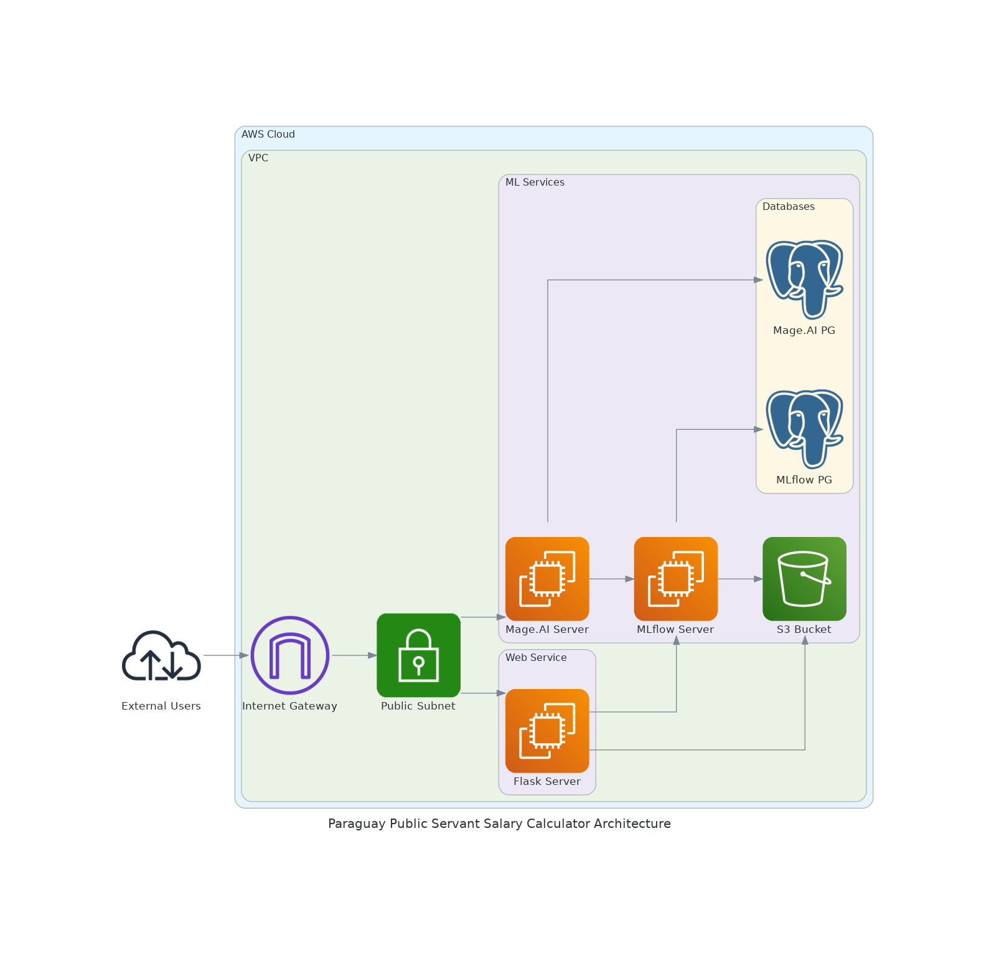

# Proyecto de Cálculo de Salarios de Empleados Públicos del Paraguay

Este proyecto está enfocado en el cálculo de los salarios de los empleados públicos del Paraguay, utilizando datos oficiales proporcionados por la Secretaría de la Función Pública.

## Descripción del Proyecto

Este proyecto combina técnicas de machine learning y desarrollo web para crear un sistema que predice los salarios de los empleados públicos del Paraguay. Los datos utilizados son descargados desde fuentes oficiales y se procesan para entrenar y validar modelos de predicción, que luego se despliegan como un servicio web.

### Fuentes de Datos

- **Datos de Empleados Públicos**: [Descargar aquí](https://datos.sfp.gov.py/data/funcionarios/download)
- **Diccionario de Datos**: [Consultar aquí](https://datos.sfp.gov.py/def/funcionarios)


## Estructura del Proyecto

- **`data/`**: Análisis de datos, experimentos y validaciones iniciales.
- **`pipelines/`**: Pipelines de datos con integración a MLflow para el seguimiento de experimentos y Evidently AI para el monitoreo del modelo.
- **`deployment/`**: Implementación del modelo como un servicio web, incluyendo pruebas unitarias y de integración, siguiendo las mejores prácticas de desarrollo.
- **`terraform/`**: Definición de la infraestructura como código (IaC) utilizando Terraform para su despliegue en la nube.
- **`utils/`**: Scripts Python útiles para la automatización de tareas y recursos como imágenes y configuraciones.
- **`.github/`**: Configuración de CI/CD para la automatización del flujo de integración y entrega continua.

## Instalación

Para instalar y configurar el proyecto, sigue los pasos a continuación. Los detalles específicos de cada entorno de desarrollo se encuentran en las subcarpetas correspondientes.

1. **Clona el Repositorio:**
   ```bash
   git clone https://github.com/tu-usuario/tu-repositorio.git
   cd tu-repositorio
   ```

2. **Instala Dependencias:**

    Cada subcarpeta del proyecto, si corresponde, tiene su propio archivo de configuración de dependencias (Pipfile y Pipfile.lock). 
    
    Para instalar las dependencias en cada subcarpeta, navega a la carpeta correspondiente y ejecuta:

    ```bash
    pipenv install
    ```
3. **Configuración Adicional:**

    - **Docker y Docker Compose:** Se recomienda tener Docker y Docker Compose instalados, especialmente para la carpeta pipelines y el despliegue de servicios web.

    - **LocalStack Pro:** Si vas a trabajar con LocalStack Pro, asegúrate de tener el LOCALSTACK_AUTH_TOKEN configurado para la funcionalidad de almacenamiento en S3 local.

Consulta los archivos específicos en cada subcarpeta para detalles adicionales sobre la configuración y las dependencias.

### Arquitectura de la Solución



La arquitectura del sistema ha sido simplificada para facilitar su desarrollo y pruebas. Sin embargo, en un entorno de producción, se recomienda implementar medidas de seguridad adicionales.

- **Científicos de Datos**: Tienen acceso a [Mage.ai](https://www.mage.ai/) para realizar experimentos. Los resultados y artefactos se registran en un servidor MLflow y se almacenan en un bucket S3.
- **Monitoreo y Reentrenamiento Automático**: Se han configurado procesos automáticos que monitorizan el rendimiento del modelo y lo reentrenan si su desempeño cae por debajo de un umbral específico. Más detalles están disponibles en la carpeta `pipelines`.
- **Persistencia de Datos**: Tanto Mage.ai como MLflow están respaldados por bases de datos que aseguran la persistencia de la información crítica.
- **Webservice en Flask**: Un servicio web, implementado en Flask, permite a los usuarios realizar predicciones de salarios. Además, mediante autenticación, se puede actualizar el modelo a una versión más reciente cuando se requiera.

## Análisis de Datos

En la carpeta `data` se encuentra un análisis exploratorio exhaustivo del dataset, que incluye:

- Exploración y análisis estadístico de los datos.
- Procesos de limpieza y preprocesamiento para preparar los datos.
- Experimentos preliminares con modelos de machine learning.

## Pipelines de Datos

La carpeta `pipelines` contiene los pipelines necesarios para procesar los datos y entrenar los modelos:

- **MLflow**: Para gestionar el seguimiento y registro de experimentos.
- **Evidently AI**: Para el monitoreo continuo del rendimiento del modelo, asegurando su robustez en producción.

## Despliegue del Modelo

En la carpeta `deployment`, se encuentra la implementación del modelo como un servicio web:

- **Pruebas Unitarias**: Aseguran la correcta funcionalidad de cada componente.
- **Pruebas de Integración**: Verifican la interacción entre componentes del sistema.
- **Servicio Web**: Implementado en Flask, este servicio permite la predicción de salarios y la actualización del modelo de manera segura mediante endpoints específicos.

## Infraestructura como Código

Toda la infraestructura necesaria para este proyecto está definida en la carpeta `terraform`, lo que permite desplegar y gestionar los recursos en la nube de manera eficiente y repetible.

## Scripts de Utilidad

La carpeta `utils` contiene scripts en Python diseñados para facilitar la automatización de diversas tareas dentro del proyecto.

## Integración Continua y Entrega Continua (CI/CD)

En la carpeta `.github`, se encuentra la configuración necesaria para implementar un flujo de CI/CD robusto, asegurando que cada cambio en el código pase por un proceso de validación antes de ser desplegado.

## Contribuciones

Las contribuciones son bienvenidas. Si tienes alguna idea o mejora, no dudes en hacer un fork del repositorio y enviar un pull request. Toda ayuda es apreciada para mejorar el proyecto.

## Licencia

[](https://opensource.org/licenses/MIT)

Este proyecto está licenciado bajo la Licencia MIT. Para más detalles, consulta el archivo [`LICENSE`](./LICENSE).

## Contacto

Para cualquier pregunta, sugerencia o problema relacionado con el proyecto, puedes ponerte en contacto con el desarrollador principal a través de su perfil de LinkedIn:

- **Jesús Oviedo Riquelme**: [LinkedIn](https://linkedin.com/in/jesusoviedoriquelme)

Si necesitas soporte adicional o tienes consultas específicas, no dudes en enviar un mensaje a través de esta plataforma.
